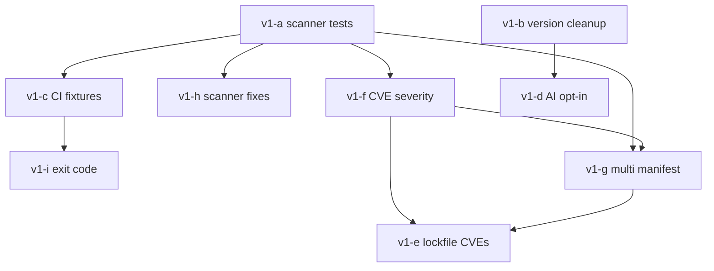

# VibeSafe slices — V1 foundation

Authority: `plan/VIBESAFE-AUDIT.md` §7, `plan/HANDOFF-VIBESAFE-WAVE-1.md`

```mermaid
graph TD
  v1a[v1-a scanner tests]
  v1b[v1-b version cleanup]
  v1f[v1-f CVE severity]
  v1h[v1-h scanner fixes]
  v1c[v1-c CI fixtures]
  v1d[v1-d AI opt-in]
  v1i[v1-i exit code]
  v1g[v1-g multi manifest]
  v1e[v1-e lockfile CVEs]

  v1a --> v1f
  v1a --> v1h
  v1a --> v1c
  v1a --> v1g
  v1b --> v1d
  v1c --> v1i
  v1f --> v1g
  v1f --> v1e
  v1g --> v1e
```
